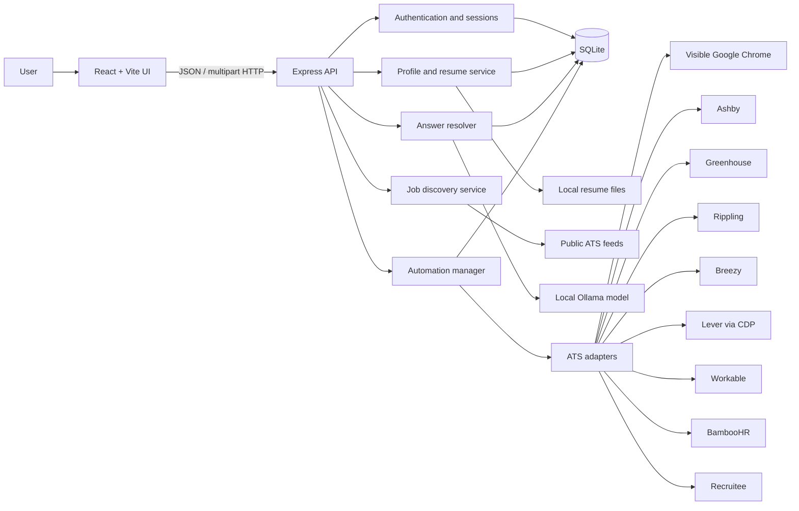
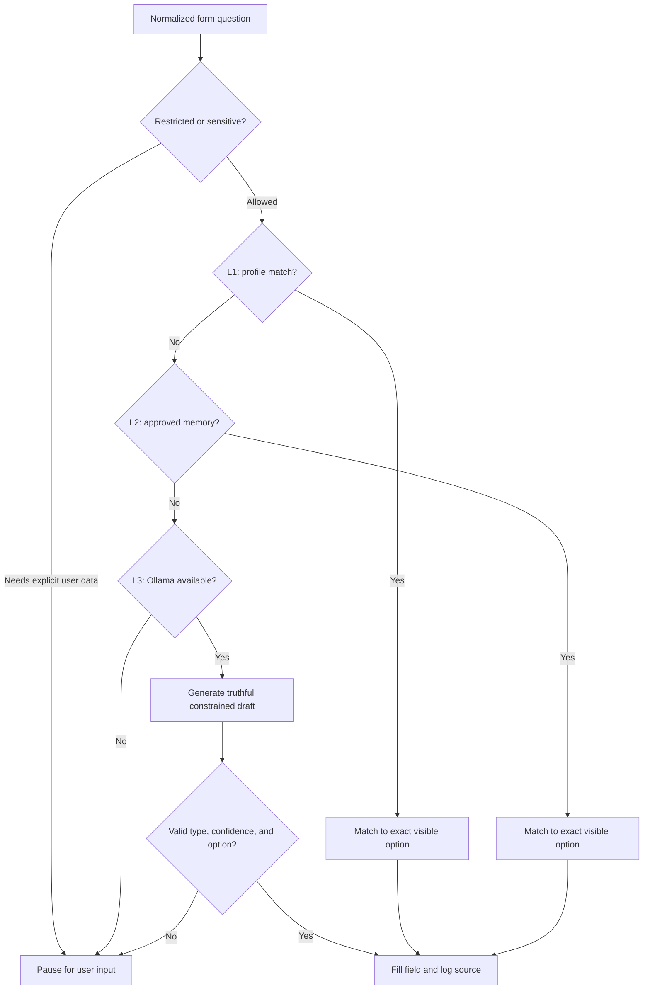

# JobCopilot

JobCopilot is a local-first job discovery and application assistant. It keeps a reusable candidate profile, finds live roles, reviews and tailors resumes with a local Ollama model, and fills supported ATS application forms in a visible Chrome window.

The application is designed around one principle: automate repetitive form work without silently inventing candidate facts. Profile data and previously approved answers are preferred, AI-written answers are constrained by the visible control type, and uncertain or protected questions can pause for user input.

## What is included

- Responsive React dashboard for desktop and mobile
- Local account and reusable application profile
- Resume upload, preview, review, job matching, and optimization suggestions
- Live job discovery from Ashby, Greenhouse, Lever, and Workable feeds
- Saved roles and application history
- Visible-browser application automation
- Pause, continue, review-before-submit, auto-submit, and testing modes
- Three-layer answer resolution: profile, approved memory, then local AI
- Exact-option matching for dropdowns, radios, checkboxes, and searchable selects
- Application adapters for Ashby, Greenhouse, Rippling, Breezy, Lever, Workable, BambooHR, and Recruitee
- Local SQLite persistence and encryption for sensitive stored answers

## Quick start

### Requirements

- Node.js 22 or newer — the backend uses the built-in `node:sqlite` module
- npm
- Google Chrome installed
- Ollama, recommended for AI-generated answers and resume analysis

### 1. Install dependencies

```bash
cd /Users/aryansingh/jobcopilot
npm install
```

### 2. Prepare the local AI model

In a separate terminal:

```bash
ollama serve
```

Pull the default model once:

```bash
ollama pull gemma3:4b
```

Ollama is optional for basic profile-driven filling. Without it, ordinary AI-generated answers may pause for user input, while resume review uses a deterministic fallback.

### 3. Start the website and API

```bash
npm run dev
```

This starts both services:

- Website: normally `http://localhost:5173`
- API: `http://127.0.0.1:3001`

If port 5173 is already occupied, Vite automatically selects the next free port, such as 5174, 5175, or 5176. Use the URL printed beside `WEB` in the terminal.

### 4. Stop the project

Press `Ctrl+C` in the terminal running `npm run dev`. This stops both the website and API processes.

## Common commands

| Command | Purpose |
| --- | --- |
| `npm run dev` | Start the website and API together with live reload |
| `npm run dev:web` | Start only the Vite website |
| `npm run dev:api` | Start only the Express API with file watching |
| `npm test` | Run the backend resolver and ATS adapter tests |
| `npm test -- --run` | Run the test suite once explicitly |
| `npm run build` | Type-check and build the frontend and backend |
| `NODE_ENV=production npm start` | Run the previously built production server |
| `npm run preview` | Preview only the built Vite frontend |

### Production-style local run

```bash
npm run build
NODE_ENV=production npm start
```

Open `http://127.0.0.1:3001`. In production mode, Express serves both the API and the compiled React application.

## Configuration

Configuration is read from environment variables. No `.env` loader is currently included, so export values in the shell before starting the project.

| Variable | Default | Purpose |
| --- | --- | --- |
| `PORT` | `3001` | Express API and production website port |
| `OLLAMA_URL` | `http://127.0.0.1:11434` | Ollama server URL |
| `OLLAMA_MODEL` | `gemma3:4b` | Model used for answer drafting and resume analysis |
| `CHROME_PATH` | Platform-specific Google Chrome path | Chrome executable used by the dedicated Lever browser |
| `LEVER_CDP_URL` | `http://127.0.0.1:9222` | Local Chrome DevTools endpoint used for Lever |
| `ASHBY_COMPANY_SLUGS` | Built-in list | Comma-separated companies used for Ashby discovery |
| `GREENHOUSE_COMPANY_SLUGS` | Built-in list | Comma-separated companies used for Greenhouse discovery |
| `LEVER_COMPANY_SLUGS` | Built-in list | Comma-separated companies used for Lever discovery |
| `WORKABLE_COMPANY_SLUGS` | Built-in list | Comma-separated companies used for Workable discovery |

Example:

```bash
export OLLAMA_MODEL=gemma3:4b
export GREENHOUSE_COMPANY_SLUGS=stripe,databricks
npm run dev
```

## Architecture overview

JobCopilot is a TypeScript modular monolith. The React single-page application and Express API live in one repository, use one local SQLite database, and coordinate browser automation through Playwright.



### Frontend

The frontend is a React and TypeScript SPA built with Vite.

- `src/App.tsx` contains the landing page, authenticated dashboard, job discovery, saved roles, application tracker, resume review, and guided automation UI.
- `src/ProfilePage.tsx` contains the reusable candidate profile and resume upload flow.
- `src/api.ts` is the frontend API helper.
- `src/styles.css` contains the design system, dashboard styling, and responsive mobile breakpoints.
- `src/main.tsx` mounts the React application.

In development, Vite proxies `/api` requests to `http://127.0.0.1:3001`. Authentication is cookie-based, so the browser does not store or manually attach an access token.

### API and application services

`server/index.ts` is the HTTP composition root. It configures Express, security middleware, request validation, file upload limits, authentication endpoints, profile APIs, job APIs, resume APIs, resolver APIs, and automation APIs.

The API uses:

- Zod for request validation
- Helmet for HTTP security headers
- Express rate limiting for authentication routes
- Multer for resume uploads, limited to one file and 10 MB
- A consistent `{ data: ... }` success envelope and `{ error: ... }` error envelope

### Local persistence

`server/database.ts` initializes SQLite and applies small additive migrations at startup.

Main tables:

| Table | Responsibility |
| --- | --- |
| `users` | Local accounts and password credentials |
| `sessions` | Hashed browser session tokens and expiration |
| `profiles` | Candidate details, application defaults, resume metadata, and encrypted voluntary information |
| `answer_memory` | User-approved answers reusable globally or for one company |
| `resolution_log` | Audit trail of how each question was resolved or paused |
| `automation_runs` | Current and historical application run state |
| `automation_events` | Ordered timeline for each automation run |
| `saved_jobs` | Saved discovery results |
| `resume_optimizations` | Job-specific resume proposals and approvals |

SQLite runs with WAL mode, foreign keys, and a busy timeout. Runtime data is created under:

```text
data/                 SQLite database and encryption key
uploads/resumes/      Uploaded default resumes
uploads/resumes/tailored/  Approved tailored Word resumes
browser-data/         Persistent Chrome profiles
```

These directories contain personal information and are intentionally ignored by Git.

## Answer resolution architecture

Every detected form question is converted to a normalized structure containing:

- Question text
- Required or optional status
- Field type: text, textarea, number, boolean, or select
- ATS-specific input type
- Visible options, when the field is a choice control

The resolver in `server/resolver/engine.ts` uses three ordered layers:



### L1 — explicit profile values

The highest-confidence source is the saved candidate profile: name, contact details, links, work history, education, authorization, sponsorship, salary, availability, location preferences, and explicitly enabled voluntary information.

### L2 — approved answer memory

If the profile does not contain an answer, the resolver searches previously approved answers using normalized question similarity. Memories can be global or restricted to a specific company.

### L3 — local Ollama drafting

Ollama is the fallback for ordinary written questions and supported choice questions. The model receives the question type and the exact visible choices. It must return one supplied choice for a choice control; generated prose is accepted only for text controls.

The resolver rejects:

- A choice not shown by the employer
- Ambiguous substring matches such as `Male` versus `Female`
- Low-confidence drafts in normal mode
- Invented candidate facts
- Choice controls whose options could not be read reliably

Every resolution is recorded with its source (`L1_PROFILE`, `L2_MEMORY`, or `L3_LLM`), confidence, and explanation.

## Browser automation architecture

The browser automation system is split into a board-independent manager and board-specific adapters.

### Automation manager

`server/automation/manager.ts` owns the application lifecycle:

1. Canonicalize and validate the job URL.
2. Detect the matching ATS adapter.
3. Open or reuse a visible Chrome context.
4. Open the application page and detect blockers.
5. Extract job details and form questions.
6. Upload the resume and wait for ATS resume parsing.
7. Re-scan the form and skip fields already populated by the ATS parser.
8. Focus and naturally scroll to each remaining field.
9. Read visible choices for dynamic dropdowns and search controls.
10. Resolve the answer through L1, L2, or L3.
11. Fill with the adapter and record an event.
12. Pause for blockers or user input when necessary.
13. Stop at the review boundary or submit when explicitly configured.

Run state and events are stored in SQLite, while active Playwright browser objects remain in memory.

### ATS adapter contract

Each adapter implements the same responsibilities:

- Recognize supported URLs
- Convert job pages to application URLs
- Wait for the application form
- Extract job details
- Extract questions and visible options
- Focus/scroll to a field
- Fill text, select, radio, checkbox, autocomplete, and file controls
- Upload the resume and wait for parsing when supported
- Detect CAPTCHA or login blockers
- Detect the review boundary
- Submit and confirm the result

Adapters live under `server/automation/adapters/<board>/`. Shared orchestration remains in the manager so adding one ATS does not require rewriting the resolution or persistence layers.

### Chrome session strategy

- Most boards use a persistent, visible Playwright Chrome context stored under `browser-data/<user-id>`.
- If that profile is already locked, JobCopilot creates an isolated fallback profile for the run.
- Lever uses a dedicated Google Chrome session connected over local CDP at port 9222.
- Browser sessions are separated by user and by the Lever/standard session class.

### Human-paced interaction

Adapters scroll fields into view, hover before actions where appropriate, type sequentially with randomized delays, and wait for dynamic option lists. These delays are for visibility and UI reliability; they do not attempt to defeat site security controls.

### CAPTCHA and login boundaries

JobCopilot detects supported CAPTCHA and login blockers, pauses the run, and asks the user to complete the step in the visible browser. It does not solve or bypass access-control challenges. Continuing resumes the same active browser session and skips fields already completed.

## Submission modes

### Submit with approval

The default mode fills the form and stops at `READY_FOR_REVIEW`. The user checks the visible browser and then explicitly approves submission.

### Auto-submit

The system submits after filling and validation. If a blocker appears, it pauses instead of bypassing it.

### Testing mode

Testing mode exists to observe the complete filling flow. It may use test-only fallback answers, but submission is always disabled. Enabling testing mode also disables auto-submit for that run.

### Manual pause and continue

An active run can be paused from the dashboard. Continue resumes the existing browser session, re-scans the form, and skips completed fields.

## Resume architecture

Resume processing is handled by `server/resumeReview.ts` and `server/resumeDocument.ts`.

- PDF text is extracted with `pdf-parse`.
- DOCX text is extracted with `mammoth`.
- Job requirements are extracted through the same ATS registry used by automation.
- Ollama generates structured review data and truthful job-specific suggestions.
- General review has a deterministic fallback when Ollama is unavailable.
- Optimization proposals preserve the original upload and require review before approval in the current UI.
- Approved tailored resumes can be generated as DOCX files.
- The automation manager can attach the most recent approved tailored resume matching the exact job URL; otherwise it uses the default resume.

The AI is instructed not to invent employers, dates, degrees, skills, achievements, metrics, or qualifications.

## Job discovery

`server/jobs.ts` aggregates public job-board feeds for configured companies:

- Ashby
- Greenhouse
- Lever
- Workable

Results are normalized to one job structure, deduplicated, sorted by publication date, and cached briefly in memory. The dashboard then provides board, remote, saved, and text filters.

Discovery support and application automation support are intentionally separate: an ATS can have an application adapter even when it is not part of the public discovery feed.

## Security and privacy

- The API binds to `127.0.0.1` by default.
- Passwords use `scrypt` with a per-password salt.
- Session cookies are HTTP-only and `SameSite=Strict`.
- Only session-token hashes are stored in SQLite.
- Voluntary information and answer memory are encrypted with AES-256-GCM.
- The local encryption key is generated at `data/jobcopilot.key` with restrictive permissions.
- Database, upload, encryption-key, and browser-profile directories are created with restrictive permissions.
- Uploaded resumes are restricted by MIME type and limited to 10 MB.
- API inputs are validated with Zod.
- Authentication endpoints are rate limited.
- Resume file responses use private, no-store caching.

This is currently a local-first development architecture. Before exposing it to the public internet, add production secret management, CSRF review, hardened CSP, centralized logging, backup/restore procedures, and a deployment-specific security review.

## API map

| Area | Main endpoints |
| --- | --- |
| Health | `GET /api/health` |
| Authentication | `POST /api/auth/signup`, `POST /api/auth/login`, `POST /api/auth/logout`, `GET /api/auth/me` |
| Profile | `GET /api/profile`, `PUT /api/profile` |
| Locations | `GET /api/locations/countries`, states, and cities endpoints |
| Resume | Upload, file preview, review, optimize, approve, preview, and download endpoints under `/api/profile/resume` |
| Answer resolver | `POST /api/resolver/resolve`, memory endpoints, and resolution logs |
| Jobs | Recommended and saved-job endpoints under `/api/jobs` |
| Automation | Board list and run create/list/get/pause/resume/submit endpoints under `/api/automation` |

## Project structure

```text
jobcopilot/
├── src/
│   ├── App.tsx                    Landing page and application dashboard
│   ├── ProfilePage.tsx            Candidate profile and resume upload
│   ├── api.ts                     Frontend API helper
│   ├── main.tsx                   React entry point
│   └── styles.css                 Design system and responsive styles
├── server/
│   ├── automation/
│   │   ├── adapters/              ATS-specific browser implementations
│   │   ├── manager.ts             Run orchestration and browser lifecycle
│   │   ├── registry.ts            URL detection and adapter registry
│   │   └── types.ts               Shared adapter contracts
│   ├── resolver/
│   │   ├── engine.ts              L1/L2/L3 answer pipeline
│   │   ├── normalizer.ts          Question normalization/classification
│   │   ├── ollama.ts              Local model provider and option guard
│   │   ├── optionMatcher.ts       Exact employer-option matching
│   │   └── policy.ts              Sensitive and non-inferable question rules
│   ├── auth.ts                    Cookie sessions
│   ├── config.ts                  Local paths and service configuration
│   ├── database.ts                SQLite schema and migrations
│   ├── index.ts                   Express API composition root
│   ├── jobs.ts                    Public job-feed aggregation
│   ├── resumeDocument.ts          Tailored DOCX generation
│   ├── resumeReview.ts            Resume extraction, scoring, and optimization
│   └── security.ts                Password hashing and AES-GCM encryption
├── data/                           Local runtime data; ignored by Git
├── uploads/                        Local resumes; ignored by Git
├── browser-data/                   Chrome profiles; ignored by Git
├── dist/                           Built frontend
├── server-dist/                    Built backend
├── package.json
├── vite.config.ts
└── README.md
```

## Testing

Run the complete automated suite:

```bash
npm test -- --run
```

The tests currently cover important correctness boundaries, including:

- ATS URL detection
- Browser-session separation
- Question normalization and canonical classification
- Exact option matching
- Overlapping choices such as Male/Female
- Pronoun and demographic selection behavior
- Greenhouse school and education controls
- Lever submit buttons and CAPTCHA detection
- Restricted-question and testing-mode policy
- Ollama response validation

Before merging an architectural change, run both:

```bash
npm test -- --run
npm run build
```

## Adding another ATS

1. Create `server/automation/adapters/<board>/`.
2. Implement a job-page reader and application-page controller.
3. Implement the `JobBoardAdapter` contract from `server/automation/types.ts`.
4. Export the adapter from its `index.ts`.
5. Register it in `server/automation/registry.ts`.
6. Add URL-detection, choice-matching, blocker, and submission-boundary tests.
7. Verify normal, testing, review, pause/resume, and CAPTCHA flows in a visible browser.

Keep ATS selectors and DOM work inside the adapter. Keep user policy, answer generation, persistence, and run lifecycle in their shared layers.

## Troubleshooting

### The website opens on a different port

Vite selected another free port. Use the `Local:` URL printed beside the `WEB` process.

### The website loads but API calls fail

Make sure `npm run dev` is running both `API` and `WEB`. If you started only `npm run dev:web`, start the API separately:

```bash
npm run dev:api
```

### Ollama answers are unavailable

Check Ollama and the installed model:

```bash
ollama list
curl http://127.0.0.1:11434/api/tags
```

Then ensure `gemma3:4b` exists or set `OLLAMA_MODEL` to an installed model.

### Chrome is not found

Set the executable explicitly before starting JobCopilot:

```bash
export CHROME_PATH="/Applications/Google Chrome.app/Contents/MacOS/Google Chrome"
npm run dev
```

### Chrome says the profile is already in use

Close leftover JobCopilot automation Chrome windows and retry. The manager can use an isolated fallback profile, but closing old automation sessions keeps local state easier to understand.

### Lever cannot connect over CDP

Ensure port 9222 is free and Google Chrome can start. To use another local port:

```bash
export LEVER_CDP_URL=http://127.0.0.1:9333
npm run dev
```

### A CAPTCHA appears

Complete it manually in the visible automation browser, return to JobCopilot, and click Continue automation. The system intentionally does not bypass CAPTCHA challenges.

### Testing mode will not submit

That is expected. Testing mode always disables submission, even if Auto-submit is selected in the UI.

## Current architectural boundaries

- Active Playwright browser objects are in memory; after an API restart, an unfinished run cannot reconnect to its previous page.
- SQLite and browser profiles are local to one machine.
- The current architecture is suited to local development and single-machine usage, not horizontally scaled deployment.
- Job-board HTML changes can require adapter selector updates.
- CAPTCHA, login, and protected declarations may require manual interaction.
- Resume optimization produces a new Word document and does not preserve the original PDF/LaTeX visual template.

These constraints are deliberate and should be revisited before turning JobCopilot into a hosted multi-user service.
